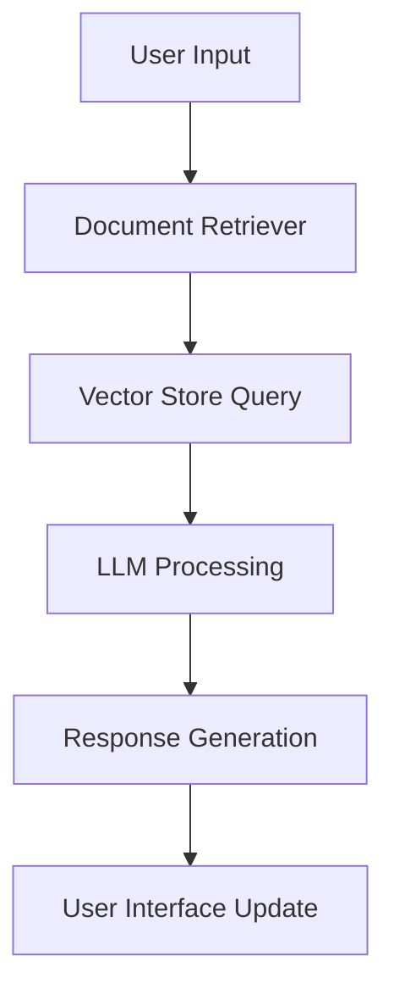

# Financial Query System

A comprehensive financial query system that integrates Retrieval-Augmented Generation (RAG) for real-time analysis using locally deployed Large Language Models. The system provides instant answers to insurance and banking queries.

## Table of Contents

- [Overview](#overview)
- [System Architecture](#system-architecture)
- [Installation](#installation)
- [Usage](#usage)
- [Screenshots](#screenshots)
- [Contact](#contact)

## Overview

The Financial Query System leverages advanced AI models to provide detailed responses to user queries related to insurance and banking. It uses a combination of local LLMs and vector databases to retrieve and generate accurate information.

## System Architecture

### Technical Stack

1. **Model Configuration**

   - Base Model: Mistral-7B-Instruct (GGUF Q4_K_M quantization)
   - Context Window: 1024 tokens
   - Temperature: 0.1 (optimized for consistency)
   - Multi-threading: Dynamic (max 4 threads)
   - Memory Footprint: ~4GB RAM

2. **Vector Store Implementation**
   - Engine: Qdrant
   - Embedding Model: all-MiniLM-L6-v2
   - Vector Dimension: 384
   - Index Type: HNSW (Hierarchical Navigable Small World)
   - Distance Metric: Cosine Similarity
   - Batch Size: 100 vectors

### System Flow



## Installation

### Prerequisites

- Python 3.8 or higher
- pip (Python package installer)

### Virtual Environment Setup

To avoid dependency conflicts without altering your dependencies, we recommend running the project in an isolated virtual environment.

#### Using venv
```bash
python -m venv venv
source venv/bin/activate  # On Windows: venv\Scripts\activate
pip install -r requirements.txt
```

#### Using Conda
```bash
conda create --name finquery python=3.8
conda activate finquery
pip install -r requirements.txt
```

### Steps

1. **Clone the repository**:

   ```bash
   git clone https://github.com/THE-DEEPDAS/Medical-pathway-LLM.git
   cd Medical-pathway-LLM
   ```

2. **Install dependencies**:

   ```bash
   pip install -r requirements.txt
   ```

3. **Download the model**:
   Ensure the model file is located at `F:/Wearables/Medical-RAG-LLM/models/mistral-7b-instruct-v0.1.Q4_K_M.gguf`.

4. **Prepare the data**:
   Place your insurance and banking PDFs in the `F:/Wearables/Medical-RAG-LLM/Data` folder.

5. **Ingest the documents**:

   ```bash
   python ingest.py
   ```

6. **Run the FastAPI server**:
   ```bash
   uvicorn rag:app --reload
   ```

## Usage

1. **Access the frontend**:
   Open your web browser and navigate to `http://localhost:8000`.

2. **Submit a query**:
   Enter your insurance or banking query in the text box and click "Submit Query".

3. **View the response**:
   The system will process your query and display the response.

## Screenshots

### Website Overview

.png>)
.png>)


## Contact

For any questions or support, please contact:

- **Deep Das**: deepdblm@gmail.com
